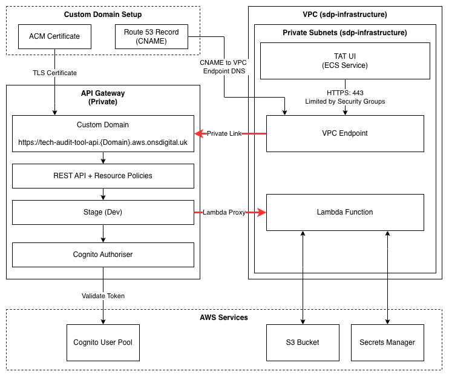

# API Networking

## Overview

The API Gateway is configured as a **private REST API** and is only reachable from within the VPC through an interface VPC endpoint for `execute-api`.

This replaces the previous public/edge access pattern and provides stable access through a private custom domain:

- `https://tech-audit-tool-api.${var.domain}.aws.onsdigital.uk`

For `sdp-dev` this resolves to:

- `https://tech-audit-tool-api.sdp-dev.aws.onsdigital.uk`

For `sdp-prod` this resolves to:

- `https://tech-audit-tool-api.sdp-prod.aws.onsdigital.uk`

## Architecture

1. API Gateway REST API endpoint type is `PRIVATE`.
2. A VPC interface endpoint for `com.amazonaws.${var.region}.execute-api` is created.
3. A resource policy on the REST API allows invocation only when `aws:SourceVpce` matches the managed endpoint.
4. A separate resource policy on the private custom domain also enforces the same `aws:SourceVpce` condition. Both policies must allow a request for it to succeed.
5. Endpoint security group allows inbound HTTPS only from the TAT UI ECS service security group.
6. A private API custom domain is created and mapped to the API stage.
7. Route53 CNAME record points the custom domain to the VPC endpoint DNS name.

## Diagram

## Terraform Layout

The API Gateway module is split by concern:

- `iam.tf`: private API resource policy document
- `network.tf`: VPC endpoint and endpoint security group
- `domain.tf`: private custom domain, certificate, mapping, DNS
- `main.tf`: API resources, methods, integrations, deployment and stage

## Access Control Model

Two layers enforce access:

1. Network layer (security groups)
- The VPC endpoint security group only permits port 443 from `data.terraform_remote_state.tat_ui.outputs.security_group_id`.
- This restricts traffic to the intended ECS service SG.

2. API layer (resource policies)
- The REST API has a resource policy requiring `aws:SourceVpce` to match the managed endpoint ID (Ensures that only requests from the approved VPC endpoint are allowed).
- The private custom domain has its own separate resource policy with the same condition.
- Both must allow the request — a deny on either will block access.
- Requests not routed through the approved VPC endpoint are denied.

## Invocation URLs

The module exports these outputs:

- `api_custom_domain_url`: stable private domain URL (recommended for clients)
- `api_gateway_private_dns_invoke_url`: private DNS execute-api URL
- `api_gateway_vpce_invoke_url`: endpoint-specific execute-api URL

Use the custom domain for client configuration stability.

### Why use a custom domain?

A custom domain was implemented for a couple of reasons:

- Avoids the invoke URLs changing when the API Gateway is redeployed (i.e. API ID changes).
- Supports backwards compatibility with the previous public API URL pattern. If this was not implemented, the UI would need a major refactor to use the new private DNS invoke URL.

## Dependencies

The API Gateway module consumes these remote states:

- `sdp_infrastructure`
  - `vpc_id`
  - `private_subnets`
- `tat_ui`
  - `security_group_id`

If these outputs are renamed in upstream stacks, update references in the API Gateway module before apply.

## Operational Notes

- Private custom domain provisioning and domain access association can take several minutes.
- ACM DNS validation records must be successfully created in the hosted zone.
- If access fails from ECS, verify:
  - ECS tasks are using the expected security group output in `tat_ui` state.
  - Endpoint SG ingress still references that SG.
  - API resource policy still matches the VPC endpoint ID.

## Known Terraform Limitations

### Private custom domain policy drift

The private custom domain resource (`aws_api_gateway_domain_name.api`) has `lifecycle { ignore_changes = [policy] }` set in [terraform/api_gateway/domain.tf](../terraform/api_gateway/domain.tf).

**Why:** AWS always normalises the resource policy ARN after creation. Terraform stores the value it computed. This causes a drift on every apply, forcing a change to be applied even though the policy is correct.

**Why `ignore_changes` is the right fix:** There is no separate `aws_api_gateway_domain_name_policy` resource in the AWS Terraform provider (unlike REST APIs which have `aws_api_gateway_rest_api_policy`). The `policy` attribute must be inline, but referencing the domain's own `domain_name_id` attribute creates a dependency cycle. Constructing the ARN from variables avoids the cycle but cannot prevent AWS normalisation drift.

**Impact:** The policy is applied correctly on first create. Subsequent applies will not update it. If the domain policy needs to be changed:

1. Temporarily remove `ignore_changes = [policy]` from `domain.tf`.
2. Apply.
3. Restore `ignore_changes = [policy]`.
4. Commit.
