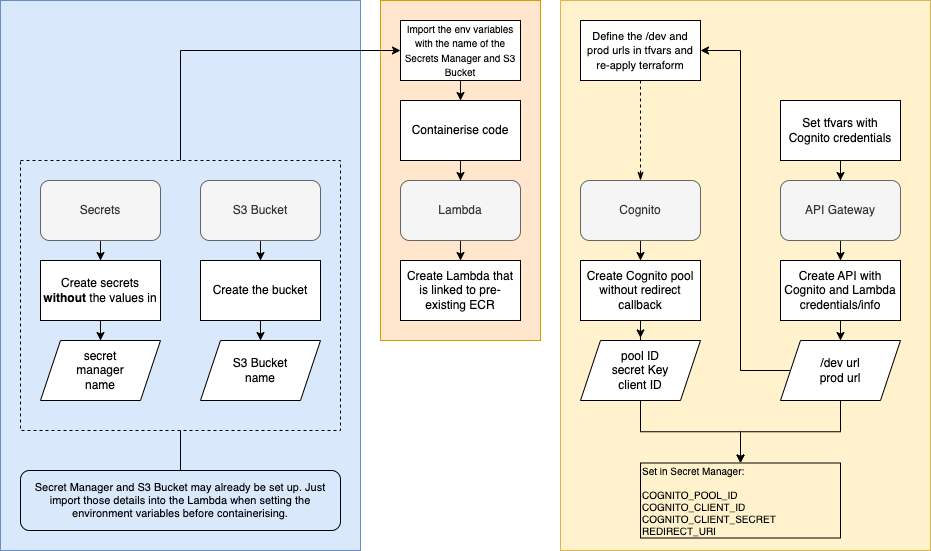
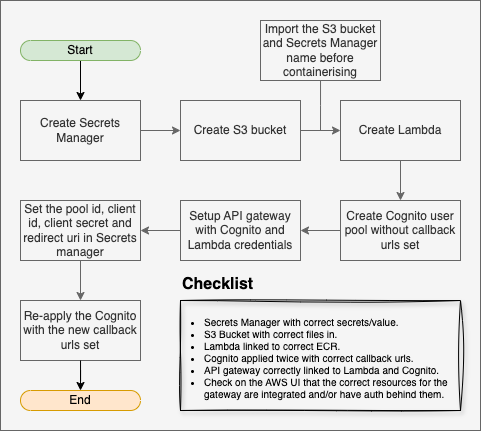

# Infrastructure

## Overview

This API is deployed on AWS using Terraform modules in the `terraform/` directory.

Before applying Terraform:

- Build and push the Lambda container image to ECR.
- Ensure an ECR repository already exists.

For container build and push steps, see the [deployment](deployment.md) guide.

## Terraform Modules

The Terraform configuration is split into five modules:

- `terraform/secrets/` (Secrets Manager)
- `terraform/storage/` (S3)
- `terraform/authentication/` (Cognito)
- `terraform/lambda/` (Lambda)
- `terraform/api_gateway/` (API Gateway)

Each module has environment-specific files under `env/<environment>/`.

For each module, set `domain` and `service_subdomain` in the tfvars file for your target environment.

## Deployment Order

### 1. ECR Repository (prerequisite)

Create the ECR repository first. It is referenced by the storage and lambda modules.

### 2. Secrets Manager (`terraform/secrets/`)

Apply this module first.

For the first apply, leave these Cognito values blank in tfvars:

- `cognito_pool_id`
- `cognito_client_id`
- `cognito_client_secret`
- `redirect_uri`

### 3. Storage (`terraform/storage/`)

Set `ecr_repository_name` in tfvars, then apply.

### 4. Authentication (`terraform/authentication/`)

Apply the Cognito module and capture outputs required by the secrets module.

### 5. Lambda (`terraform/lambda/`)

Set the following lambda-specific variables before apply:

- `ecr_repository` (ECR repository containing the Lambda image)
- `container_ver` (image tag to deploy)
- `azure_secret_name` (Secrets Manager secret name for Teams alert credentials)
- `branch_name` (alert gate: only `main` sends alerts)
- `aws_account_name` (environment label shown in alert messages)

The secret referenced by `azure_secret_name` must contain JSON in this shape:

```json
{
  "azure_tenant_id": "tenant-id",
  "azure_client_id": "client-id",
  "azure_client_secret": "client-secret",
  "azure_scope": "https://graph.microsoft.com/.default",
  "azure_webhook_url": "https://example.webhook.office.com/..."
}
```

### 6. API Gateway (`terraform/api_gateway/`)

Apply the API Gateway module and note output URLs.

### 7. Re-apply Secrets Manager (`terraform/secrets/`)

Update and re-apply secrets with Cognito values populated:

- `cognito_pool_id`
- `cognito_client_id`
- `cognito_client_secret`
- `redirect_uri`

### 8. Complete



## Terraform Configuration Diagram


