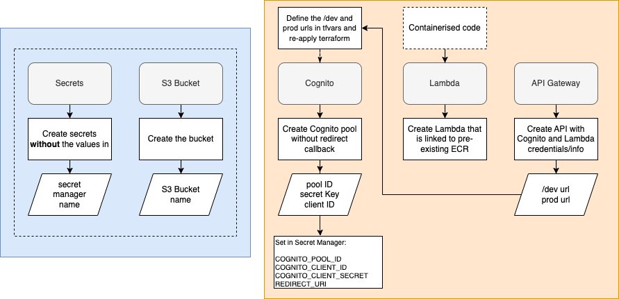
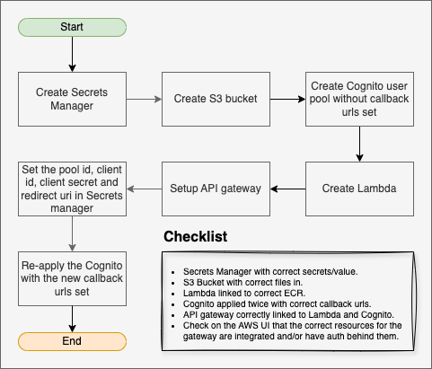

# Infrastructure

## AWS Resources

Before terraforming the API, you must have the API Python code containerised, using Docker, and have an elastic container registry (ECR) available.

Please refer to the [deployment](deployment.md) guide for more information.

There are **5** AWS resources that are created by the terraform script:

- Secrets Manager (Secrets)
- S3 Bucket (Storage)
- Cognito User Pool (Authentication)
- Lambda Function (Lambda)
- API Gateway (api_gateway)

Go through the list and deploy each resource one by one.

For each resource, you will need to set the `domain` and `service_subdomain` variables in the `tfvars` file.

### 1. ECR Repository

Make sure you have an ECR repository created in the AWS account. This will be used in the `S3 bucket` and `Lambda function`.

### 2. Secrets Manager

Run like normal. Leave the `cognito_pool_id`, `cognito_client_id`, `cognito_client_secret`, and `redirect_uri` variables blank. 

### 3. S3 Bucket

Set the `ecr_repository_name` variable in the `tfvars` file. Then run the terraform script.

### 4. Cognito User Pool

Run like normal.

### 5. Lambda Function

The tech audit S3 bucket and the secrets manager secret are created by the terraform script. The aws cognito token url is set by the terraform script. Then run the terraform script for the lambda function and this data is set in the lambda function.

The Lambda Terraform now composes shared modules for the IAM role/security group and the Lambda resource itself. You still provide the image details via `ecr_repository` and `container_ver` (tag). Optionally, you can pin to an immutable image digest using `container_digest` to avoid tag lookup issues.

After apply, you can confirm the exact image (including digest) via the `lambda_image_uri` Terraform output.

### 6. API Gateway

Run like normal. Note down the URLs in the outputs.

### 7. Secrets Manager Re-application

Go back to the `Secrets Manager` resource and set the `cognito_pool_id`, `cognito_client_id`, `cognito_client_secret`, and `redirect_uri` variables.

### 8. Finished

## Terraform Configuration

Flow chart explanation of the Terraform setup and infrastructure components.

